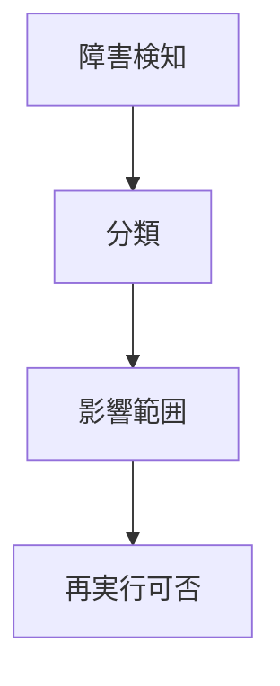
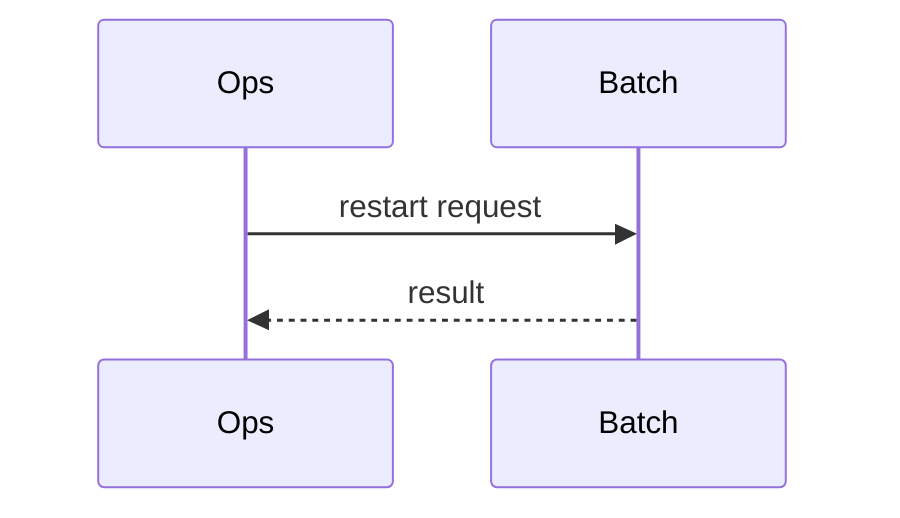

# PDF Regression Sample

障害時の初動は、障害分類、影響範囲、再実行可否を確認することを基本とする。

リスタート、スキップ、自動リトライを採用する場合は、対象条件と運用手順を個別設計で定義する。

| 項目 | 条件 | 担当 | 記録 | 再実行 | 通知 | 備考 | 期限 |
| --- | --- | --- | --- | --- | --- | --- | --- |
| 障害分類 | 必須 | 運用 | 必須 | 判断後 | 必須 | CJK確認 | 即時 |
| 影響範囲 | 必須 | 業務 | 必須 | 判断後 | 必須 | 幅広表 | 即時 |

## Long Section

この段落はページ分割の回帰確認用である。テンプレートの余白、CJK フォント、Mermaid 図、表、ページ番号が同時に存在しても、PDF 生成結果が破綻しないことを確認する。

この段落はページ分割の回帰確認用である。テンプレートの余白、CJK フォント、Mermaid 図、表、ページ番号が同時に存在しても、PDF 生成結果が破綻しないことを確認する。

この段落はページ分割の回帰確認用である。テンプレートの余白、CJK フォント、Mermaid 図、表、ページ番号が同時に存在しても、PDF 生成結果が破綻しないことを確認する。

この段落はページ分割の回帰確認用である。テンプレートの余白、CJK フォント、Mermaid 図、表、ページ番号が同時に存在しても、PDF 生成結果が破綻しないことを確認する。

この段落はページ分割の回帰確認用である。テンプレートの余白、CJK フォント、Mermaid 図、表、ページ番号が同時に存在しても、PDF 生成結果が破綻しないことを確認する。

この段落はページ分割の回帰確認用である。テンプレートの余白、CJK フォント、Mermaid 図、表、ページ番号が同時に存在しても、PDF 生成結果が破綻しないことを確認する。

この段落はページ分割の回帰確認用である。テンプレートの余白、CJK フォント、Mermaid 図、表、ページ番号が同時に存在しても、PDF 生成結果が破綻しないことを確認する。

この段落はページ分割の回帰確認用である。テンプレートの余白、CJK フォント、Mermaid 図、表、ページ番号が同時に存在しても、PDF 生成結果が破綻しないことを確認する。

