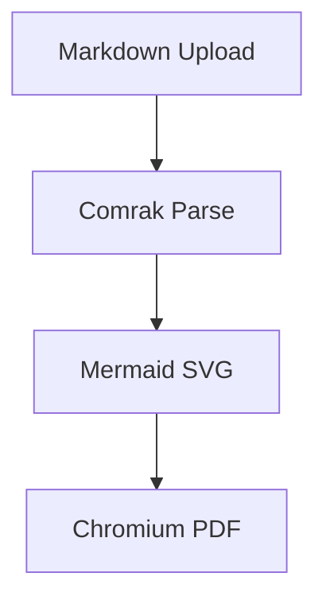

# 画面設計方針

これは Markdown から PDF への変換 smoke test です。

## URL 設計

| No | 画面 | Method | URL | 権限 | 入力 | 出力 | 備考 |
| --- | --- | --- | --- | --- | --- | --- | --- |
| 1 | 一覧 | GET | /admin/design/documents?keyword=very-long-keyword | admin | keyword, page, size | document list | 長い URL と多列テーブルの折り返し確認 |
| 2 | 詳細 | GET | /admin/design/documents/{document_id}/preview | admin | document_id | html preview | SVG diagram embedded |

## Notes

- Mermaid は SVG として埋め込む。
- 表格は固定レイアウトで折り返す。
