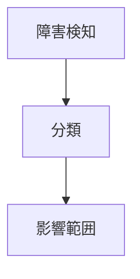
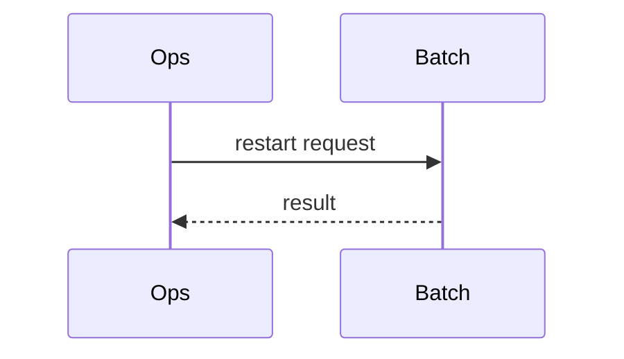

# ページ番号とMermaid検証

```mermaid
flowchart TD
  A[障害検知] --> B[分類]
  B --> C[影響範囲]
```
障害時の初動は、障害分類、影響範囲、再実行可否を確認することを基本とする。

```mermaid
sequenceDiagram
  participant Ops
  participant Batch
  Ops->>Batch: restart request
  Batch-->>Ops: result
```
リスタート、スキップ、自動リトライを採用する場合は、対象条件と運用手順を個別設計で定義する。

| 項目 | 内容 |
| --- | --- |
| 再実行 | 条件を確認してから実施 |
| スキップ | 影響範囲を記録 |
